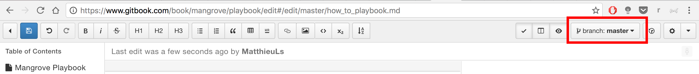
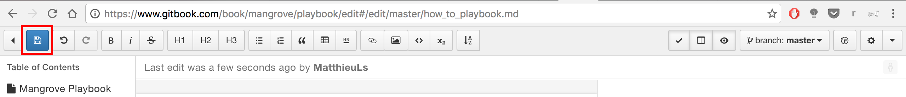
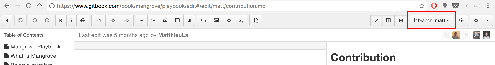
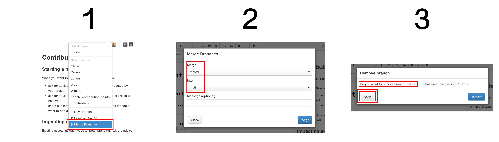

# How to update the Playbook

*updated: 2016 dec 6th*

**First of all : check that you have the rights to edit the parts you want to edit. See the **[Playbook Rules](mangrove.gitbooks.io/playbook/content/playbook.html)

### Method 1 : Simple but Risky

#####When to use this method ?
* When you are absolutely certain that no one is editing the playbook at the same time as you do.
**WARNING : If someone else is editing it at the same time, you can erase her work when saving yours**

#####What to do ?
1. **Go to** [www.gitbook.com/book/mangrove/playbook/edit](www.gitbook.com/book/mangrove/playbook/edit)

2. **Check that you are on branch “master”:**  

3. **Make your changes** to the files
 
4. When you are ready to publish your changes :

  a. **Click on the “save” button:** 
            
  b. **Just wait** : the changes should be online within the minute

### Method 2 : Safe ###

#####When to use this method ? 
* When other people might be editing the playbook at the same time

* When you want take time to work on your changes before publishing them

#####What to do ?
1. **Go to** [www.gitbook.com/book/mangrove/playbook/edit](www.gitbook.com/book/mangrove/playbook/edit)

2. **Go on a branch of yours** (eg: the one with your name) **or create one:** 

3. **Merge the branch ‘master’ into your current branch:** 
        
	*do not delete the ‘master’ branch after the merge (be sure to click ‘keep’)*
        
4. **Make your changes** to the files

5. **Click on the “save” button each time you want to save your progress** (it does not change the published playbook): 
        
6. When you are ready to publish your changes :

  ....a. If you suspect that someone might have worked on the same files as you did since you started editing, **repeat step 3. : merge branch ‘master’ into your current branch**. (It will integrate her changes in you file and you will see if they merge harmoniously, or if there is a ‘merge conflict’)

  ....b. **Then, merge your current branch into ‘master’** (when prompted, you can accept to delete your branch if you don’t need it anymore): 

  ....c. **Just wait** : the changes should be online within the minute

### Method 3 : For administrators

The raw git repository can be fetched from
git clone https://git.gitbook.com/mangrove/playbook.git
OR
git fetch origin (if you already have it)

You can then compare branch states, clean up things and make push requests if needed

